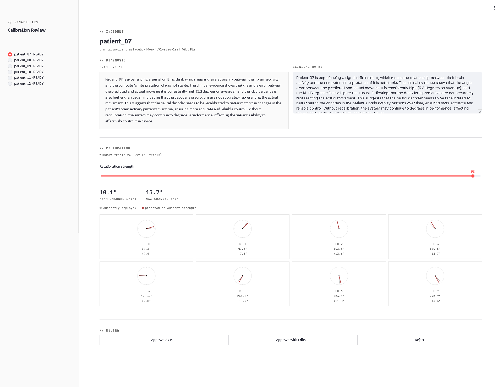
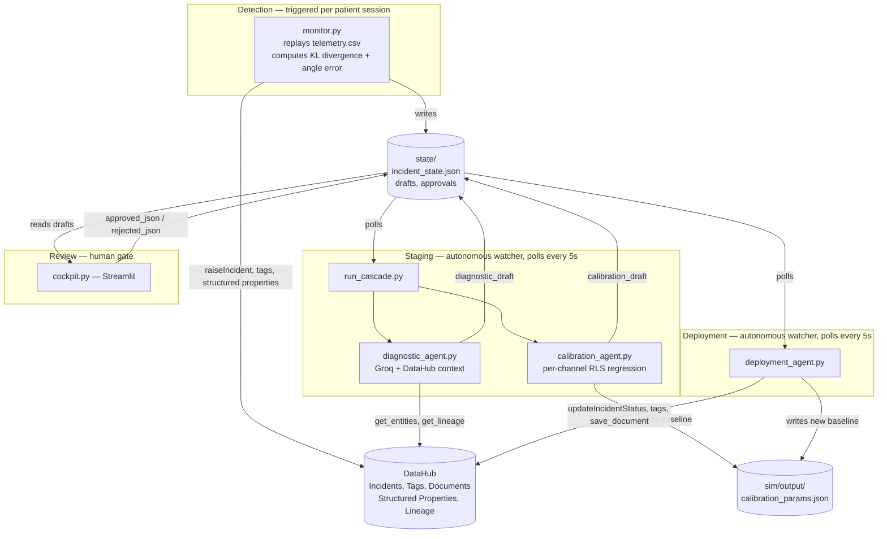
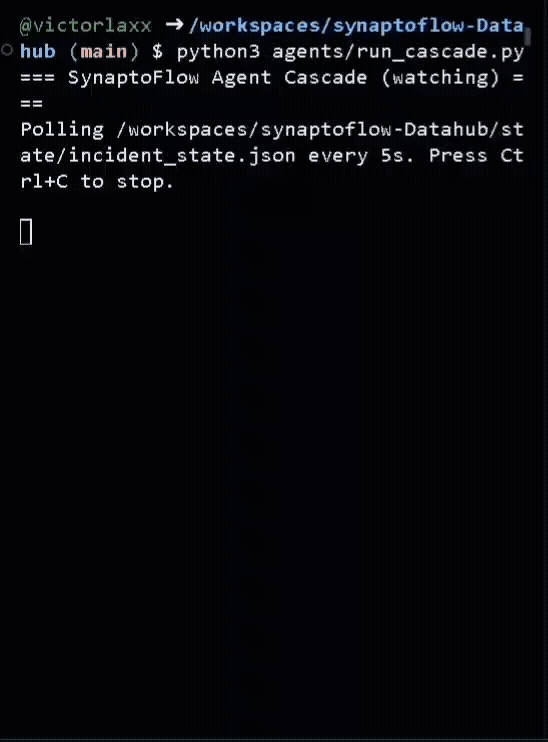

# SynaptoFlow

### Context-Aware Drift Recovery for Neural Decoders

[](https://python.org)
[](https://datahub.com)
[](https://github.com/acryldata/mcp-server-datahub)
[](https://streamlit.io)
[](./LICENSE)

A BCI decoder reads neural signal and translates it into intent — a cursor movement, a cup being reached for. Every decoder drifts: the tissue around the electrode shifts, the signal changes, and the mapping the decoder was calibrated on stops being accurate. SynaptoFlow is an agent cascade that watches for that drift, diagnoses it with real DataHub context, drafts a statistically grounded recalibration, and stages it for a clinician to approve — built with the same safety posture a real clinical deployment would require: nothing is ever written to the decoder without an explicit human decision. Every step of the cascade reads and writes through DataHub itself — the incident is a real DataHub Incident, the diagnosis is drafted from real DataHub lineage, and the final decision is written back as a real Document any future agent or clinician can read, so context accumulates instead of evaporating after each session.


---

## Table of contents

- [What it does](#what-it-does)
- [Architecture](#architecture)
- [How the simulated BCI works](#how-the-simulated-bci-works)
- [The DataHub entity model](#the-datahub-entity-model)
- [Understanding the cockpit](#understanding-the-cockpit)
- [Proof it actually works — a real run against live DataHub](#proof-it-actually-works--a-real-run-against-live-datahub)
- [Quickstart](#quickstart)
- [Troubleshooting DataHub Quickstart](#troubleshooting-datahub-quickstart)
- [Configuration](#configuration)
- [The 12 simulated patients](#the-12-simulated-patients)
- [DataHub features used](#datahub-features-used)
- [Project structure](#project-structure)
- [License](#license)

---

## What it does

- **Detects drift from real signal.** `monitor.py` computes rolling angle error and KL divergence against a calibration baseline, raising a real DataHub `Incident` the moment either guardrail is crossed (KL divergence past 0.5, or rolling angle error past 11°).
- **Diagnoses with real DataHub context.** The Diagnostic Agent pulls the decoder's actual entity and lineage graph through the MCP Server, combines it with the real telemetry trend, and drafts a plain-English explanation grounded in that data.
- **Recalibrates with real statistics.** The Calibration Agent runs a genuine recursive least squares fit, processed trial-by-trial, per channel, against a fresh calibration window — the same technique used in real closed-loop decoder adaptation research, recovering each channel's actual current preferred direction directly from telemetry.
- **A human makes the call, every time.** A clinician reviews the diagnosis and proposed recalibration in a Streamlit cockpit, adjusts the blend strength live, and explicitly approves, edits, or rejects. Nothing downstream acts until this happens.
- **Writes the decision back into the graph.** Every reviewed incident — approved or rejected — gets a `Decision` Document saved to DataHub, linked to the model and dataset, so the next agent or clinician inherits the full context of what happened and why. On approval specifically, the incident is also resolved and the deployment's drift tags flip.
- **Runs on its own between the two moments that need a human.** Two watcher processes react automatically to new incidents and new approvals. The only manual actions anywhere in the system are triggering a new patient session and making the clinical call.

---


## Architecture



`state/` is a local index, not the source of truth — it tracks which patients have an incident the pipeline hasn't finished acting on yet. The actual incident lifecycle lives entirely in DataHub; `deployment_agent.py` clears a patient's entry once their case is fully resolved, so a future drift for the same patient is correctly treated as new.

---



## How the simulated BCI works

There's no real hardware anywhere in this project. `sim/simulator.py` generates every channel's telemetry from scratch using **cosine tuning** — the same population-vector-coding model real motor-cortex BCI decoding research uses to describe how a channel's firing rate relates to intended movement direction:

```
signal_channel = baseline + amplitude · cos(intended_angle − channel_preferred_direction) + noise
```

Each of the decoder's 8 channels has its own **preferred direction** — the movement angle it responds most strongly to. The decoder does real population-vector decoding: it takes each channel's live signal, subtracts baseline, and combines the channels weighted by the cosine/sine of the preferred directions it was calibrated on, to reconstruct the intended movement angle. `calibration_params.json` is exactly that list of 8 assumed preferred directions.

**Drift is a random walk.** Over the course of a simulated session, each channel's *true* preferred direction wanders slowly, standing in for electrode micro-movement and tissue response. The decoder keeps using the original, now-stale directions from `calibration_params.json`. The growing gap between what the decoder assumes and what's actually true is exactly what surfaces as rising Angle Error and KL divergence — and it's exactly what the Calibration Agent's RLS fit recovers: it fits the same cosine model against a fresh telemetry window to find each channel's *current* true preferred direction.

One naming overlap worth flagging so it doesn't read as an inconsistency: the simulator's own first 60 trials of every session exist purely to set the *reference* distribution KL divergence is measured against — unrelated to the decoder's own calibration, which happens once, at trial 0, and never moves for the rest of the session. The Calibration Agent's "calibration window" is a different 60 trials again — the most recent ones, used only when a recalibration is actually being drafted.

To be explicit, since it matters for a clinical-adjacent concept: this is a research prototype demonstrating a production-ML-monitoring pattern for BCI decoders, built entirely on synthetic telemetry — not software that touches a real neural implant or makes real clinical decisions.

---

## The DataHub entity model

This project's state is spread across five DataHub entity types. Here's which one holds what:

| Entity | What it is here | What lives on it |
|---|---|---|
| `Dataset` (`raw_neural_stream_patientXX`) | The patient's raw telemetry stream | The Structured Properties (`AngleErrorDegrees`, `KLDivergenceScore`) and the drift `Incident` itself |
| `MLFeatureTable` / `MLFeature` | Extracted band-power features | Lineage only — links the raw dataset to the model |
| `MLModel` / `MLModelGroup` | The decoder | Real training-run lineage back to the features and raw dataset |
| `MLModelDeployment` (`live_session_patientXX`) | The patient's live decoder session | The `drift-baseline` / `drift-drifted` and `resolution-ai-proposed` / `resolution-human-modified` Tags |
| `Document` | A saved decision record | Created once per *reviewed* incident — approved or rejected — linked via `relatedAssets` to both the model and the dataset |

**Why Incidents and Structured Properties sit on the `Dataset`, not the `MLModelDeployment`:** DataHub's Structured Properties — and, by the same restricted-asset-list pattern, Incidents — only support a fixed list of asset types: Datasets, Charts, Dashboards, Data Flows, Data Jobs. ML entity types aren't on that list; defining a property with `entity_types: [mlModelDeployment]` fails outright with `Unknown entityTypeUrn: urn:li:entityType:datahub.mlModelDeployment`. This isn't just a workaround, either — KL divergence is fundamentally a property of the incoming data's statistics, so the `Dataset` is arguably the more correct place for it anyway.

**What `drift-baseline` and `drift-drifted` actually mean:** they're a mutually exclusive pair of Tags on the `MLModelDeployment`. `drift-drifted` is present exactly when that patient has an open, unresolved drift `Incident` — it's the fast, searchable "is this patient currently flagged" signal across the whole fleet, at a glance, without opening any one deployment. The moment `deployment_agent.py` resolves the incident, the tag flips back to `drift-baseline`. A deployment that's never drifted, and one that drifted and was successfully recalibrated, both read `drift-baseline` — the tag reflects current state, not history; the history lives in the `Document`.

**Worth knowing up front:** `MLModelDeployment` entities don't show up in the DataHub UI's default search, the MCP Server's own `search` tool, or the graph explorer's lineage view — all three checked directly, not assumed. `get_entities` also returns nothing usable for one (`"exists but no data could be retrieved"` — the underlying GraphQL query has explicit cases for `MLModel` through `MLFeature`, but none for `MLModelDeployment`). None of that means the entity or its tags aren't real — a direct REST call always returns them correctly (see [Proof it actually works](#proof-it-actually-works--a-real-run-against-live-datahub)) — it just means the UI and the standard MCP tools aren't the place to look for this one specific entity type yet.

---

## Understanding the cockpit

Reviewing an open incident, top to bottom:

- **Agent draft / Clinical notes** — two side-by-side panels: the Diagnostic Agent's write-up on the left, read-only, and an editable notes field on the right, pre-filled with that same text so the clinician can annotate or rewrite it before submitting anything.
- **Calibration window** — states the exact trial range the Calibration Agent's fit ran against.
- **Recalibration strength slider (0–100%)** — starts at whatever default strength the Calibration Agent itself proposed for this patient — currently a flat 100% for every proposal, since that default isn't varied per patient yet, though the field exists for that. Moving it live-updates two summary numbers (mean and max channel shift, in degrees) and every dial below it.
- **The eight channel dials** — one small compass per channel. Each shows a faint gray line for that channel's currently deployed direction, and a second line pointing to the proposed direction at the current slider position — blended along the shortest path around the circle, so a channel sitting near the 0°/360° wraparound doesn't get an artificially inflated shift. That second line turns red once the shift crosses 1°, and renders dashed whenever that channel's fit confidence (R²) drops below 0.5 — so a shaky fit reads visually different from a confident one at a glance, rather than looking equally trustworthy. Small reference ticks mark 0°/90°/180°/270° around the ring; 0° points right and angles increase counterclockwise, matching the same convention as the cosine-tuning math the rest of the system runs on. Under each dial: the channel number, the proposed angle, and the signed shift from what's currently deployed.
- **Low-confidence warning** — if any channel's fit falls under that R² threshold, a banner below the grid names exactly which ones, so a shaky fit is called out rather than folded quietly into the recommendation.
- **Approve As-Is / Approve With Edits / Reject** — Approve As-Is deploys the Calibration Agent's own suggested strength, unmodified. Approve With Edits deploys whatever strength the slider was left at. Reject deploys nothing to the decoder and leaves the incident open — but a `Decision` Document is still saved to DataHub recording what was proposed and why it was turned down, so nothing gets silently dropped. Whichever one is clicked, the screen locks into a read-only summary of that decision, with no further edits available — intentional, not a bug (see [Architecture](#architecture)).

---

## Proof it actually works — a real run against live DataHub

This is `patient_07`, approved as-is through the cockpit, run against a real local DataHub instance. Four independent confirmations, not a single success line.

**1. The deployment agent's own output:**
```
Found 1 approved file(s) to process...
[OK]     patient_07: deployed at 100.0% strength (approved_as_is) | doc: urn:li:document:shared-222df00b-9990-48a2-a395-e27e36481a53
```

**2. Tags, confirmed via a direct REST call to DataHub's GMS:**
```json
"com.linkedin.common.GlobalTags": {
    "tags": [
        {"tag": "urn:li:tag:drift-baseline"},
        {"tag": "urn:li:tag:resolution-ai-proposed"}
    ]
}
```
`drift-drifted` is correctly absent — back at baseline, tagged with the provenance this approval type carries. We use the REST API here rather than the DataHub UI for `MLModelDeployment` entities specifically — the MCP Server's `entity_details.gql` has explicit query fragments for every sibling ML entity type, `MLModel` through `MLPrimaryKey`, but none for `MLModelDeployment` yet. Traced this directly in the MCP Server's own source, and the REST workaround is fully reliable. (Full breakdown of what does and doesn't surface `MLModelDeployment` entities is in [The DataHub entity model](#the-datahub-entity-model).)

**3. A real Document, correctly linked** — title `Recalibration Decision - patient_07 - approved_as_is`, type `Decision`, related to `raw_neural_stream_patient_07` and `decoder_patient_07`. Contains the full diagnosis, the clinical notes, and the per-channel recalibration table.

**4. The calibration baseline changed to the exact fitted values:**
```
Before: [7.673814705990466, 54.816036324967776, 89.72128457340229, 134.2028606795345,
         176.6062316718671, 230.5818522925623, 273.11172335996554, 312.267290271456]
After:  [17.47, 47.34, 103.57, 120.23, 178.68, 241.23, 284.32, 298.63]
```

The incident was independently confirmed resolved in the DataHub UI as well.

### Run this yourself, against any patient

The REST check above isn't just what we saw — it's fully reproducible against your own instance, for any patient, not just `patient_07`. `MLModelDeployment` entities aren't reachable through the DataHub UI or the MCP Server's `search`/`get_entities` tools, so this REST call is the actual, decisive way to check one:

```bash
Load your credentials into the terminal :
set -a; source .env; set +a

PATIENT=patient_07   # swap for any patient_01–patient_12
curl -s "http://localhost:8080/entities/urn:li:mlModelDeployment:(urn:li:dataPlatform:synaptoflow,live_session_${PATIENT},PROD)" \
  -H "Authorization: Bearer $DATAHUB_GMS_TOKEN" | python3 -m json.tool
```

Look for the `com.linkedin.common.GlobalTags` aspect in the output. Before any incident: `drift-baseline` only. After a drift incident is resolved: `drift-baseline` plus either `resolution-ai-proposed` (Approve As-Is) or `resolution-human-modified` (Approve With Edits) — and `drift-drifted` genuinely absent either way, since that tag only exists while the incident is still open. If the proposal was rejected instead, the deployment stays tagged `drift-drifted` — expected, not a bug, since rejection intentionally leaves the incident open.

---

## Quickstart

This runs against a real, self-hosted DataHub instance — the `.devcontainer/` config (4 CPU / 16GB RAM, Docker-in-Docker) sets one up automatically if you're using a Codespace; adjust accordingly if running locally with your own Docker.

Steps 1–11 below all run in the **same terminal** — several of them need real credentials in the shell environment, and that only persists within one terminal session. Steps 12–15 each get their own terminal, since they're long-running processes left open.

**1. Clone and install**
```bash
git clone https://github.com/dekunlab/synaptoflow-Datahub.git
cd synaptoflow-Datahub
pip install -r requirements.txt
```

**2. Confirm `uvx` is available** — every agent shells out to it to run the MCP Server
```bash
uvx --version
```
If this fails with `command not found`, run `export PATH=$HOME/.local/bin:$PATH` once in this terminal, then try again. (This is fixed permanently for every future terminal via `postCreateCommand` — see the note at the end of this section if you're customizing the devcontainer yourself.)

**3. Start a local DataHub instance**
```bash
datahub docker quickstart
```

**4. Enable token-based authentication** — off by default on a fresh install
```bash
datahub docker quickstart --stop
```
This fully stops the running containers, which matters more than it looks: `docker-compose.yml` is only read when containers are created or restarted, so editing it while they're still up does nothing until they're actually stopped and started again. Having `acryl-datahub` installed via `requirements.txt` (step 1) doesn't change this — that only gives you the `datahub` CLI tool that *issues* commands like this one; it's a separate thing from the Docker containers it's talking to, and installing it doesn't remove the need to stop them before editing their config.

Edit `~/.datahub/quickstart/docker-compose.yml`: find `METADATA_SERVICE_AUTH_ENABLED` under the `datahub-gms-quickstart` service — it's already there, just set to `false` — and change it to `true`. Add the same line under the `frontend-quickstart` service (note: not `datahub-frontend-quickstart`, that name doesn't exist in the generated compose file).
```bash
datahub docker quickstart --quickstart-compose-file ~/.datahub/quickstart/docker-compose.yml
```

**5. Generate a Personal Access Token**

DataHub UI (`http://localhost:9002`) → Settings → Access Tokens → Generate new token.

**6. Configure secrets**
```bash
cp .env.example .env
```
Edit `.env` with the token from step 5 and your `GROQ_API_KEY` (Groq's free tier takes under a minute to sign up for at console.groq.com).

**7. Load `.env` into this terminal and initialize the DataHub CLI**
```bash
set -a; source .env; set +a
datahub init
```
`datahub init` picks up the values you just exported and writes them to `~/.datahubenv` — the `datahub` CLI (used in the next step and step 9) reads from there, not from `.env` directly.

**8. Register the structured property definitions this project uses**
```bash
datahub properties upsert -f ingest/properties.yaml
```

**9. Generate the simulated telemetry** — fixed seed, always produces identical output
```bash
python3 sim/simulator.py
```

**10. Populate DataHub with the base entities** — datasets, features, models, deployments
```bash
python3 ingest/ingest.py
```

**11. Establish real lineage** (dataset → calibration run → model), then sanity check everything connected
```bash
python3 ingest/add_training_runs.py
python3 mcp_test/test_client.py
```
`mcp_test/test_client.py` should print `Connected. N tools available.` followed by real search results — not an error.

**12–13. Start the two background watchers, each in its own new terminal, and leave them running**
```bash
python3 agents/run_cascade.py
```
```bash
python3 agents/deployment_agent.py
```

**14. Start the review UI, in another new terminal**
```bash
streamlit run cockpit.py
```

**15. Trigger a real drift incident, in one more terminal**
```bash
python3 monitor/monitor.py
```

Within a few seconds of step 15, the already-running `run_cascade.py` terminal (step 12) wakes up on its own and stages a diagnosis and calibration proposal. Open the cockpit, review it, and click Approve or Reject — `deployment_agent.py` reacts the same way, unattended. Once a patient shows `REVIEWED` in the cockpit, its slider and buttons lock into a static summary — that's intentional (see [Architecture](#architecture)), not a bug.

`telemetry.csv` is entirely simulated by `sim/simulator.py`, using a fixed random seed so every run reproduces identical output. Swapping in real device telemetry would only ever touch that one file's data and the ingestion step's inputs — nothing downstream of it knows or cares where the numbers came from.

If you're customizing `.devcontainer/devcontainer.json` yourself, the `uvx`-on-PATH fix from step 2 can be made permanent for every future terminal by changing `postCreateCommand` to:
```json
"postCreateCommand": "pip install --user -r requirements.txt && echo 'export PATH=$HOME/.local/bin:$PATH' >> ~/.bashrc"
```

---

## Troubleshooting DataHub Quickstart

None of this is guaranteed to happen — `datahub docker quickstart` has also come up clean for us on fresh Codespaces, first try, on other runs. But across repeated testing we hit a few different failure patterns worth having a fix ready for, in case one shows up for you too.

**`datahub-mysql-1` shows `Error` right after quickstart starts.** Usually not a real failure — MySQL builds its data files on first start, which can take a few minutes, but Docker only waits about 20 seconds before marking the container unhealthy. It's often still working underneath the error. Don't delete it:

1. Let quickstart keep running. If it gives up with `gms is not running`, ignore that — the setup work it already did is still valid.
2. Wait for MySQL to actually finish (check with `docker logs datahub-mysql-1`).
3. Run the migration step manually:
   ```bash
   docker start datahub-system-update-quickstart-1
   docker logs -f datahub-system-update-quickstart-1
   ```
   Wait for `Upgrade SystemUpdate completed with result SUCCEEDED`.
4. Start the rest:
   ```bash
   docker start datahub-datahub-gms-quickstart-1 \
                datahub-datahub-actions-quickstart-1 \
                datahub-frontend-quickstart-1
   datahub docker check
   ```

**`Current application secret bits: 112, minimal required bits ... 256`.** Generate a longer secret and use it in place of the existing one before re-running:
```bash
openssl rand -base64 48
```

**`system-update-quickstart` exits with code 1.** We saw this intermittently without pinning one exact single cause. A clean reset before retrying is the safest fix regardless of which of the above you hit:
```bash
docker compose -p datahub down
```
Then retry from [Quickstart](#quickstart) step 3.

Tested and confirmed working on a 4-core / 16GB Codespace (the `.devcontainer/` default) — if you're running on something smaller, first-boot slowness is more likely.

---

## Configuration

All secrets and runtime options live in a git-ignored `.env` file, loaded via `python-dotenv`. Copy `.env.example` to `.env` and fill in the two required values:

| Variable | Required | Default | Purpose |
|---|---|---|---|
| `DATAHUB_GMS_TOKEN` | Yes | — | Auth token for your DataHub GMS instance |
| `GROQ_API_KEY` | Yes | — | Used by the Diagnostic Agent to draft explanations. Groq's API has a genuinely free tier |
| `DATAHUB_GMS_URL` | No | `http://localhost:8080` | Your DataHub instance's GMS endpoint |
| `DATAHUB_TELEMETRY_ENABLED` | No | `true` | DataHub's own anonymous usage-analytics beacon. Set to `false` to skip several seconds of retry delay per call in network-restricted environments like GitHub Codespaces |

---

## The 12 simulated patients

`sim/simulator.py` generates 12 patients spanning zero drift to severe drift, so the pipeline can be observed behaving correctly across the full range — including correctly doing nothing when nothing is wrong.

| Patient | Drift severity | Behavior |
|---|---|---|
| `patient_01`, `patient_02` | None (0.0) | No incident ever raised |
| `patient_03`, `patient_04` | Minimal (0.05) | Below threshold for the full session |
| `patient_05`–`patient_08` | Moderate (0.3–0.9) | Crosses the guardrail partway through the session |
| `patient_09`–`patient_12` | Severe (1.1–2.3) | Crosses early, stays drifted — the clearest recalibration candidates |

Run the Calibration Agent against a zero-drift patient and the fit reports ~0.6° of "drift" — noise floor, the behavior you'd expect from a real statistical fit and the behavior you'd distrust from a hardcoded one.

---

## DataHub features used

| Feature | Where |
|---|---|
| **MCP Server** | Every agent — entity reads, lineage reads, tag mutations, incident mutations, document writes |
| **Incidents** | `monitor.py` raises them; `deployment_agent.py` resolves them with a real `updateIncidentStatus` mutation, `state` and `stage` both set |
| **Tags** | Drift state (`drift-baseline` / `drift-drifted`) and decision provenance (`resolution-ai-proposed` / `resolution-human-modified`), applied to the live `MLModelDeployment` entity — see [The DataHub entity model](#the-datahub-entity-model) for what each state means |
| **Structured Properties** | Live angle-error and KL-divergence metrics, refreshed on the raw telemetry `Dataset` entity as the session progresses |
| **Documents (Knowledge)** | Every deployment decision — approved or rejected — is saved as a `Decision` document, linked via `relatedAssets` to the model and dataset |
| **Lineage** | The Diagnostic Agent reads the decoder's real upstream lineage via `get_lineage` before drafting its explanation |

---

## Project structure

```
.devcontainer/
  devcontainer.json         — 4 CPU / 16GB Codespace, Docker-in-Docker, forwarded ports
monitor/
  monitor.py                — drift detection, raises real DataHub Incidents
agents/
  diagnostic_agent.py       — LLM diagnosis grounded in real DataHub context
  calibration_agent.py      — per-channel RLS regression
  run_cascade.py            — autonomous staging watcher
  deployment_agent.py       — autonomous deployment watcher
cockpit.py                  — Streamlit review UI, the human gate
ingest/
  properties.yaml           — structured property definitions (angle error, KL divergence)
  ingest.py                 — populates DataHub with datasets, features, models, deployments
  add_training_runs.py      — establishes real lineage from dataset through to model
mcp_test/
  test_client.py            — smoke test for MCP Server connectivity
sim/
  simulator.py               — generates the 12 simulated patients
  output/                     — telemetry.csv, calibration_params.json (git-ignored, regenerated)
state/                       — live pipeline data: incidents, drafts, approvals (git-ignored, regenerated)
examples/                     — curated real outputs, one of each approval outcome
```

---

## License

Apache-2.0 — see [`LICENSE`](./LICENSE).