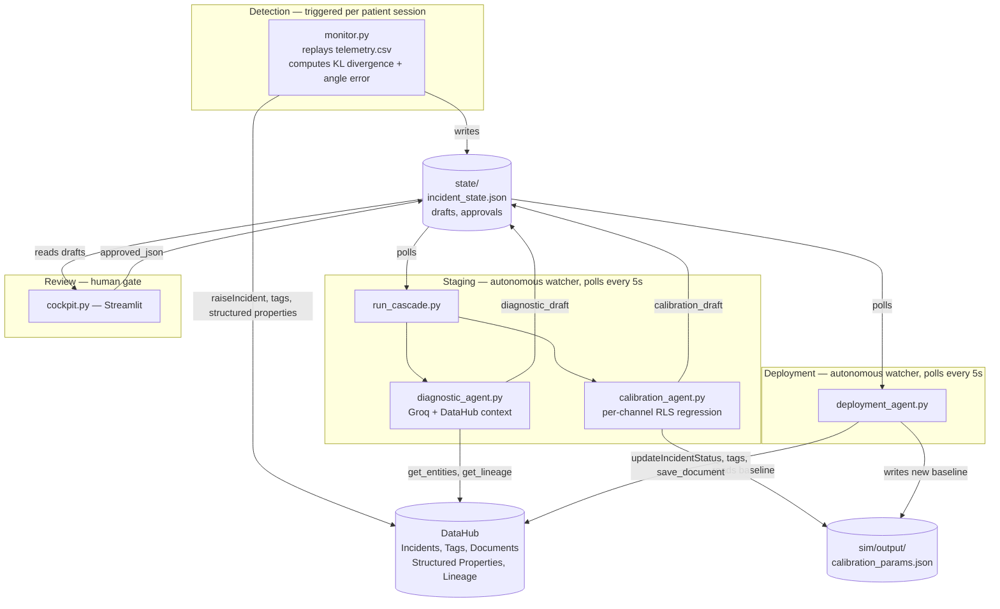

# SynaptoFlow

### Context-Aware Drift Recovery for Neural Decoders

[](https://python.org)
[](https://datahub.com)
[](https://github.com/acryldata/mcp-server-datahub)
[](https://streamlit.io)
[](./LICENSE)

A BCI decoder reads neural signal and translates it into intent — a cursor movement, a cup being reached for. Every decoder drifts: the tissue around the electrode shifts, the signal changes, and the mapping the decoder was calibrated on stops being accurate. SynaptoFlow is an agent cascade that watches for that drift, diagnoses it with real DataHub context, drafts a statistically grounded recalibration, and stages it for a clinician to approve — built with the same safety posture a real clinical deployment would require: nothing is ever written to the decoder without an explicit human decision. Every step of the cascade reads and writes through DataHub itself — the incident is a real DataHub Incident, the diagnosis is drafted from real DataHub lineage, and the final decision is written back as a real Document any future agent or clinician can read, so context accumulates instead of evaporating after each session.


---

## Table of contents

- [What it does](#what-it-does)
- [Architecture](#architecture)
- [Proof it actually works — a real run against live DataHub](#proof-it-actually-works--a-real-run-against-live-datahub)
- [Quickstart](#quickstart)
- [Configuration](#configuration)
- [The 12 simulated patients](#the-12-simulated-patients)
- [DataHub features used](#datahub-features-used)
- [Project structure](#project-structure)
- [License](#license)

---

## What it does

- **Detects drift from real signal.** `monitor.py` computes rolling angle error and KL divergence against a calibration baseline, raising a real DataHub `Incident` the moment either guardrail is crossed.
- **Diagnoses with real DataHub context.** The Diagnostic Agent pulls the decoder's actual entity and lineage graph through the MCP Server, combines it with the real telemetry trend, and drafts a plain-English explanation grounded in that data.
- **Recalibrates with real statistics.** The Calibration Agent runs a genuine recursive least squares fit, processed trial-by-trial, per channel, against a fresh calibration window — the same technique used in real closed-loop decoder adaptation research, recovering each channel's actual current preferred direction directly from telemetry.
- **A human makes the call, every time.** A clinician reviews the diagnosis and proposed recalibration in a Streamlit cockpit, adjusts the blend strength live, and explicitly approves, edits, or rejects. Nothing downstream acts until this happens.
- **Writes the decision back into the graph.** Once approved, the incident is resolved, the deployment's drift tags flip, and a `Decision` Document is saved to DataHub — linked to the model and dataset — so the next agent or clinician inherits the full context of what happened and why.
- **Runs on its own between the two moments that need a human.** Two watcher processes react automatically to new incidents and new approvals. The only manual actions anywhere in the system are triggering a new patient session and making the clinical call.

---

## Architecture



`state/` is a local index, not the source of truth — it tracks which patients have an incident the pipeline hasn't finished acting on yet. The actual incident lifecycle lives entirely in DataHub; `deployment_agent.py` clears a patient's entry once their case is fully resolved, so a future drift for the same patient is correctly treated as new.

---

## Proof it actually works — a real run against live DataHub

This is `patient_07`, approved as-is through the cockpit, run against a real local DataHub instance. Four independent confirmations, not a single success line.

**1. The deployment agent's own output:**
```
Found 1 approved file(s) to process...
[OK]     patient_07: deployed at 100.0% strength (approved_as_is) | doc: urn:li:document:shared-222df00b-9990-48a2-a395-e27e36481a53
```

**2. Tags, confirmed via a direct REST call to DataHub's GMS:**
```json
"com.linkedin.common.GlobalTags": {
    "tags": [
        {"tag": "urn:li:tag:drift-baseline"},
        {"tag": "urn:li:tag:resolution-ai-proposed"}
    ]
}
```
`drift-drifted` is correctly absent — back at baseline, tagged with the provenance this approval type carries. We use the REST API here rather than the DataHub UI for `MLModelDeployment` entities specifically — the MCP Server's `entity_details.gql` has explicit query fragments for every sibling ML entity type, `MLModel` through `MLPrimaryKey`, but none for `MLModelDeployment` yet. Traced this directly in the MCP Server's own source, and the REST workaround is fully reliable.

**3. A real Document, correctly linked** — title `Recalibration Decision - patient_07 - approved_as_is`, type `Decision`, related to `raw_neural_stream_patient_07` and `decoder_patient_07`. Contains the full diagnosis, the clinical notes, and the per-channel recalibration table.

**4. The calibration baseline changed to the exact fitted values:**
```
Before: [7.673814705990466, 54.816036324967776, 89.72128457340229, 134.2028606795345,
         176.6062316718671, 230.5818522925623, 273.11172335996554, 312.267290271456]
After:  [17.47, 47.34, 103.57, 120.23, 178.68, 241.23, 284.32, 298.63]
```

The incident was independently confirmed resolved in the DataHub UI as well.

---

## Quickstart

This runs against a real, self-hosted DataHub instance — the `.devcontainer/` config (4 CPU / 16GB RAM, Docker-in-Docker) sets one up automatically if you're using a Codespace; adjust accordingly if running locally with your own Docker.

Steps 1–11 below all run in the **same terminal** — several of them need real credentials in the shell environment, and that only persists within one terminal session. Steps 12–15 each get their own terminal, since they're long-running processes left open.

**1. Clone and install**
```bash
git clone https://github.com/dekunlab/synaptoflow-Datahub.git
cd synaptoflow-Datahub
pip install -r requirements.txt
```

**2. Confirm `uvx` is available** — every agent shells out to it to run the MCP Server
```bash
uvx --version
```
If this fails with `command not found`, run `export PATH=$HOME/.local/bin:$PATH` once in this terminal, then try again. (This is fixed permanently for every future terminal via `postCreateCommand` — see the note at the end of this section if you're customizing the devcontainer yourself.)

**3. Start a local DataHub instance**
```bash
datahub docker quickstart
```

**4. Enable token-based authentication** — off by default on a fresh install
```bash
datahub docker quickstart --stop
```
Edit `~/.datahub/quickstart/docker-compose.yml`: find `METADATA_SERVICE_AUTH_ENABLED` under the `datahub-gms-quickstart` service — it's already there, just set to `false` — and change it to `true`. Add the same line under the `frontend-quickstart` service (note: not `datahub-frontend-quickstart`, that name doesn't exist in the generated compose file).
```bash
datahub docker quickstart --quickstart-compose-file ~/.datahub/quickstart/docker-compose.yml
```

**5. Generate a Personal Access Token**

DataHub UI (`http://localhost:9002`) → Settings → Access Tokens → Generate new token.

**6. Configure secrets**
```bash
cp .env.example .env
```
Edit `.env` with the token from step 5 and your `GROQ_API_KEY` (Groq's free tier takes under a minute to sign up for at console.groq.com).

**7. Load `.env` into this terminal and initialize the DataHub CLI**
```bash
set -a; source .env; set +a
datahub init
```
`datahub init` picks up the values you just exported and writes them to `~/.datahubenv` — the `datahub` CLI (used in the next step and step 9) reads from there, not from `.env` directly.

**8. Register the structured property definitions this project uses**
```bash
datahub properties upsert -f ingest/properties.yaml
```

**9. Generate the simulated telemetry** — fixed seed, always produces identical output
```bash
python3 sim/simulator.py
```

**10. Populate DataHub with the base entities** — datasets, features, models, deployments
```bash
python3 ingest/ingest.py
```

**11. Establish real lineage** (dataset → calibration run → model), then sanity check everything connected
```bash
python3 ingest/add_training_runs.py
python3 mcp_test/test_client.py
```
`mcp_test/test_client.py` should print `Connected. N tools available.` followed by real search results — not an error.

**12–13. Start the two background watchers, each in its own new terminal, and leave them running**
```bash
python3 agents/run_cascade.py
```
```bash
python3 agents/deployment_agent.py
```

**14. Start the review UI, in another new terminal**
```bash
streamlit run cockpit.py
```

**15. Trigger a real drift incident, in one more terminal**
```bash
python3 monitor/monitor.py
```

Within a few seconds of step 15, the already-running `run_cascade.py` terminal (step 12) wakes up on its own and stages a diagnosis and calibration proposal. Open the cockpit, review it, and click Approve or Reject — `deployment_agent.py` reacts the same way, unattended. Once a patient shows `REVIEWED` in the cockpit, its slider and buttons lock into a static summary — that's intentional (see [Architecture](#architecture)), not a bug.

`telemetry.csv` is entirely simulated by `sim/simulator.py`, using a fixed random seed so every run reproduces identical output. Swapping in real device telemetry would only ever touch that one file's data and the ingestion step's inputs — nothing downstream of it knows or cares where the numbers came from.

If you're customizing `.devcontainer/devcontainer.json` yourself, the `uvx`-on-PATH fix from step 2 can be made permanent for every future terminal by changing `postCreateCommand` to:
```json
"postCreateCommand": "pip install --user -r requirements.txt && echo 'export PATH=$HOME/.local/bin:$PATH' >> ~/.bashrc"
```

---

## Configuration

All secrets and runtime options live in a git-ignored `.env` file, loaded via `python-dotenv`. Copy `.env.example` to `.env` and fill in the two required values:

| Variable | Required | Default | Purpose |
|---|---|---|---|
| `DATAHUB_GMS_TOKEN` | Yes | — | Auth token for your DataHub GMS instance |
| `GROQ_API_KEY` | Yes | — | Used by the Diagnostic Agent to draft explanations. Groq's API has a genuinely free tier |
| `DATAHUB_GMS_URL` | No | `http://localhost:8080` | Your DataHub instance's GMS endpoint |
| `DATAHUB_TELEMETRY_ENABLED` | No | `true` | DataHub's own anonymous usage-analytics beacon. Set to `false` to skip several seconds of retry delay per call in network-restricted environments like GitHub Codespaces |

---

## The 12 simulated patients

`sim/simulator.py` generates 12 patients spanning zero drift to severe drift, so the pipeline can be observed behaving correctly across the full range — including correctly doing nothing when nothing is wrong.

| Patient | Drift severity | Behavior |
|---|---|---|
| `patient_01`, `patient_02` | None (0.0) | No incident ever raised |
| `patient_03`, `patient_04` | Minimal (0.05) | Below threshold for the full session |
| `patient_05`–`patient_08` | Moderate (0.3–0.9) | Crosses the guardrail partway through the session |
| `patient_09`–`patient_12` | Severe (1.1–2.3) | Crosses early, stays drifted — the clearest recalibration candidates |

Run the Calibration Agent against a zero-drift patient and the fit reports ~0.6° of "drift" — noise floor, the behavior you'd expect from a real statistical fit and the behavior you'd distrust from a hardcoded one.

---

## DataHub features used

| Feature | Where |
|---|---|
| **MCP Server** | Every agent — entity reads, lineage reads, tag mutations, incident mutations, document writes |
| **Incidents** | `monitor.py` raises them; `deployment_agent.py` resolves them with a real `updateIncidentStatus` mutation, `state` and `stage` both set |
| **Tags** | Drift state (`drift-baseline` / `drift-drifted`) and decision provenance (`resolution-ai-proposed` / `resolution-human-modified`), applied to the live `MLModelDeployment` entity |
| **Structured Properties** | Live angle-error and KL-divergence metrics, refreshed on the raw telemetry `Dataset` entity as the session progresses |
| **Documents (Knowledge)** | Every deployment decision — approved or rejected — is saved as a `Decision` document, linked via `relatedAssets` to the model and dataset |
| **Lineage** | The Diagnostic Agent reads the decoder's real upstream lineage via `get_lineage` before drafting its explanation |

---

## Project structure

```
.devcontainer/
  devcontainer.json         — 4 CPU / 16GB Codespace, Docker-in-Docker, forwarded ports
monitor/
  monitor.py                — drift detection, raises real DataHub Incidents
agents/
  diagnostic_agent.py       — LLM diagnosis grounded in real DataHub context
  calibration_agent.py      — per-channel RLS regression
  run_cascade.py            — autonomous staging watcher
  deployment_agent.py       — autonomous deployment watcher
cockpit.py                  — Streamlit review UI, the human gate
ingest/
  properties.yaml           — structured property definitions (angle error, KL divergence)
  ingest.py                 — populates DataHub with datasets, features, models, deployments
  add_training_runs.py      — establishes real lineage from dataset through to model
mcp_test/
  test_client.py            — smoke test for MCP Server connectivity
sim/
  simulator.py               — generates the 12 simulated patients
  output/                     — telemetry.csv, calibration_params.json (git-ignored, regenerated)
state/                       — live pipeline data: incidents, drafts, approvals (git-ignored, regenerated)
examples/                     — curated real outputs, one of each approval outcome
```

---

## License

Apache-2.0 — see [`LICENSE`](./LICENSE).